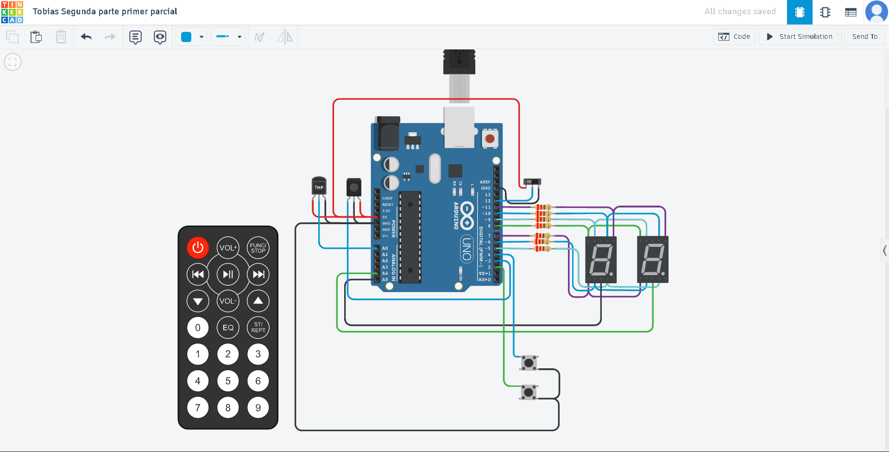

# Documentacion

## Integrantes 
- Tobias Esquivel

## Proyecto: Contador 7segmentos.

## Descripción
Este proyecto consta de una placa de arduino en la cual el usuario puede contar hasta 99 aumentando, reduciendo y reiniciando
el valor numerico reflejado en los 7segmentos

## Función principal
Esta funcion se encarga de en primer instancia apagar los leds que previamente
pudieron quedar encendidos en el 7 segmentos actual seguido de 
el prender de el numero pasado por parametro reflejado visualmente en el 7 segmentos

~~~ C (lenguaje en el que esta escrito)
void encenderNumero(int numero)
{
  apagarLeds();
  switch (numero)
  {
    case 0:
      encenderNumeroCero();
      break;
    case 1:
      encenderNumeroUno();
      break;
    case 2:
      encenderNumeroDos();
      break;
    case 3:
      encenderNumeroTres();
      break;
    case 4:
      encenderNumeroCuatro();
      break;
    case 5:
      encenderNumeroCinco();
      break;
    case 6:
      encenderNumeroSeis();
      break;
    case 7:
      encenderNumeroSiete();
      break;
    case 8:
      encenderNumeroOcho();
      break;
    case 9:
      encenderNumeroNueve();
      break;
  }
}
~~~

## Link al proyecto
- [proyecto](https://www.tinkercad.com/things/1Br1fVLu0Qv-swanky-bruticus/editel?sharecode=QMg_0cW1Uu3E9RxVkFx9nJz79JENm1NEdw5IkpSSxw8)

## Esquema del proyecto
- [esquema](./Esquema/esquema.png)

## Multiplexación

En este proyecto la multiplexacion se controla principalmente segun las siguientes lineas de codigo

if (digitalRead(UNIDAD) == LOW)
{
  digitalWrite(DECENA,LOW);
  digitalWrite(UNIDAD,HIGH);  
}
else 
{
  digitalWrite(DECENA,HIGH);
  digitalWrite(UNIDAD,LOW);
}

En ellas lo que se hace es que en el caso de que el pin que esta conectado al 7 segmentos ,que 
representa la unidad numerca, este dandole un 0 por valor, es decir que se pueda encender,
se intercambie por 1 para que no pueda encenderse y al mismo tiempo que ocurre esto, el 7 segmentos
de las decenas se activa y opera como debe.
En el otro caso de que esa condicion sea falsa ocurre lo contrario, para mostrar el valor requerido
para el 7segmentos de turno, entran en juego las siguientes lineas:

if (digitalRead(UNIDAD) == LOW)
{
  numeroAMostrar = contador % 10;
}
else
{
  numeroAMostrar = contador / 10;
}
encenderNumero(numeroAMostrar);

en ellas lo que sucede es que en caso de que se requiera mostrar la unidad solo se queda con el valor unitario del numero compuesto
y en caso de que se requiera mostrar la decena, solo se queda con el valor que ocupa la misma en el numero.

## investigación -> Objeto: Control remoto

El control remoto es un objeto que nos permite que a travez de sus botones, podamos asignarle 
a cada uno una funcionalidad en particular para afectar a nuestro arduino

La integracion del mismo en el proyecto es la de que a travez de sus botones 1 y 2, suba y baje el contador
del numero representado en el 7 segmentos

  Control remoto: Descripcion del componente

  El mismo para funcionar tiene un receptor el cual es el que nos permite recibir las ondas
  de frecuencia proporcionadas por el control remoto.

  A travez de la funcion "IrReceiver.begin(PIN_REMOTO, DISABLE_LED_FEEDBACK); " en el 
  apartado de setup, podremos inicializar el mismo en nuestro arduino.

Funcionamiento dentro del programa y cuales son las instrucciones proporcionadas:

  // Control remoto
  ~~~ C
  if (IrReceiver.decode()){ // Decodifica la entrada del control remoto y retorna 1 si es correcta
    switch (IrReceiver.decodedIRData.decodedRawData) // Al valor que decodeo el receptor, lo contemplamos para verificar su valor
    {
      case 0xEF10BF00: // En caso de que sea el equivalente al retorno que seria la representacion del boton 1
      mostrarPrimos ? indiceNumeroPrimo++ : numeroEnteroActual++; // Aumenta el contador del numero respectivo
      	break;
      case 0xEE11BF00:// En caso de que sea el equivalente al retorno que seria la representacion del boton 2
      mostrarPrimos ? indiceNumeroPrimo-- : numeroEnteroActual--; // Reduce el contador del numero respectivo
      	break;
      
    }
      control.resume();
    
  }
  // Fin control remoto